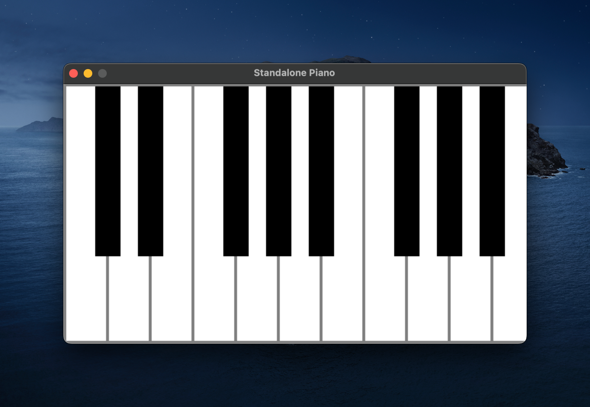

[Blog](https://tushartripathi.me/posts/midi-keyboard/)

### Problem -

- You don't have an actual piano or keyboard. But you want to use an app like Simply Piano etc. on phone which either require you to connect a MIDI keyboard, or even if they display on screen keyboard, it's clumsy to use because of less space.

- Wouldn't it be nice if you could use your laptop's keyboard, as it would be easier to play with physical keys.


### Approach

This is where our script comes in. There is a virtual piano built with pygame, which listens to keyboard events, plays the corresponding notes, and also displays the pressed notes on the screen.

In addition, it connects to a RTP Midi server(you can use [this app](https://play.google.com/store/apps/details?id=com.awisman.midiconnectorfree&hl=en_IN) on android to start a server. Note that the phone and the computer must be on the same wifi network. Make sure to change the ip address in the script accordingly. In the MIDI connector app, select input as RTP Midi and virtual device in the output. After this, you can use any app which requires MIDI input controlling it with your keyboard. Do make sure that the app is configured to run in background on Android, if it doesn't work.





## Steps to run

Ensure that you have python installed.

1. Clone the repository

```bash
git clone https://github.com/triptu/keyboard-midi.git
```

2. Setup venv

```bash
python3 -m venv .venv
source .venv/bin/activate
```

3. Install dependencies (Mac)

If you're on MacOs, first install portaudio -

```bash
brew install portaudio
```

4. Install dependencies

```bash
pip install pygame
pip install tinysoundfont
pip install coloredlogs
pip install https://github.com/mik3y/pymidi/archive/main.zip
```

4. Run the script

```bash
python pymidi-client.py
```

5. You can also just run the standalone piano without midi client if you want to play
   on desktop only.

```bash
python standalone-keyboard.py
```
